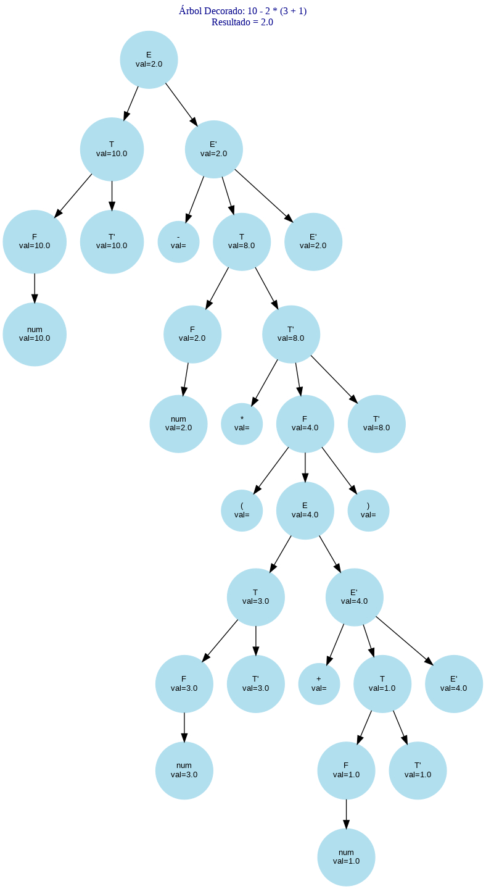

## Proyecto Traducción Dirigida por Sintaxis

Para el siguiente proyecto se desarrolló un traductor básico dirigido por sintaxis que permite el desarrollo de operaciones aritméticas básicas como sumas, resta, multiplicación y división. Se consideró la implementación de un esquema de traducción dirigido por la sintaxis, en donde se implementó una gramática independiente del contexto. El proyecto se desarrolló en fases tales como: Diseño de la gramática, definición de atributos, el cálculo de conjuntos de primeros, segundos y producción, la generación de un AST decorado, tabla de símbolos como lo propone la definición dirigida por la sintaxis, el uso de la gramática de atributos y por último el esquema de traducción dirigido por sintaxis.

## Fase 1 Gramática 

Para la gramática de este proyecto de operaciones aritméticas, se consideró la siguiente:

E -> E + T | E - T | T

T -> T * F | T / F | F

F -> (E) | num 

En adición se consideró la siguiente derivación para una gramática de tipo LL(1)

E  → T E'

E' → + T E' | - T E' | ε

T  → F T'

T' → * F T' | / F T' | ε

F  → (E) | num

Donde se consideró que E es una expresión que representa las sumas y restas, T es un término para multiplicaciones y divisiones, F representará el factor de números u operaciones en paréntesis y num será un número como token terminal. A su vez es de considerar que esta gramática permite el respeto a la precedencia de operaciones.

## Fase 2 Atributos

Para la fase de atributos se implementaron los siguientes con respecto a la gramáticas establecida con anterioridad:

E	.val	Valor total de la expresión

E'	.inh, .val	Valor acumulado de sumas/restas

T	.val	Valor de un término (multiplicaciones/divisiones)

T'	.inh, .val	Valor acumulado de productos/divisiones

F	.val	Valor de un número o subexpresión (E)

## Fase 3 Conjunto de Primeros, Segundos y preducción 

Los conjuntos de primeros, segundos y de predicción generados para la gramática base se consideraron tales como:

Primeros:

E  ->	{ (, num }

E' ->	{ +, -, ε }

T  ->	{ (, num }

T' ->	{ *, /, ε }

F  ->	{ (, num }

Segundos: 

E  ->	{ ), $ }

E' ->	{ ), $ }

T  ->	{ +, -, ), $ }

T' ->	{ +, -, ), $ }

F  ->	{ *, /, +, -, ), $ }

Predicción:

E -> T E'	{ (, num }

E' -> + T E'	{ + }

E' -> - T E'	{ - }

E' -> ε	{ ), $ }

T -> F T'	{ (, num }

T' -> * F T'	{ * }

T' -> / F T'	{ / }

T' -> ε	{ +, -, ), $ }

F -> (E)	{ ( }

F -> num	{ num }

## Fase 4 (Árbol decorado)

Para la creación del árbol se decidió la derivación de la gramática para un analizador de tipo LL(1), quedando de la siguiente forma:

E  → T E'

E' → + T E' | - T E' | ε

T  → F T'

T' → * F T' | / F T' | ε

F  → (E) | num

En la siguiente imagen se puede observar el árbol decorado para la siguiente operación ejemplo: 10 - 2 * (3 + 1)

